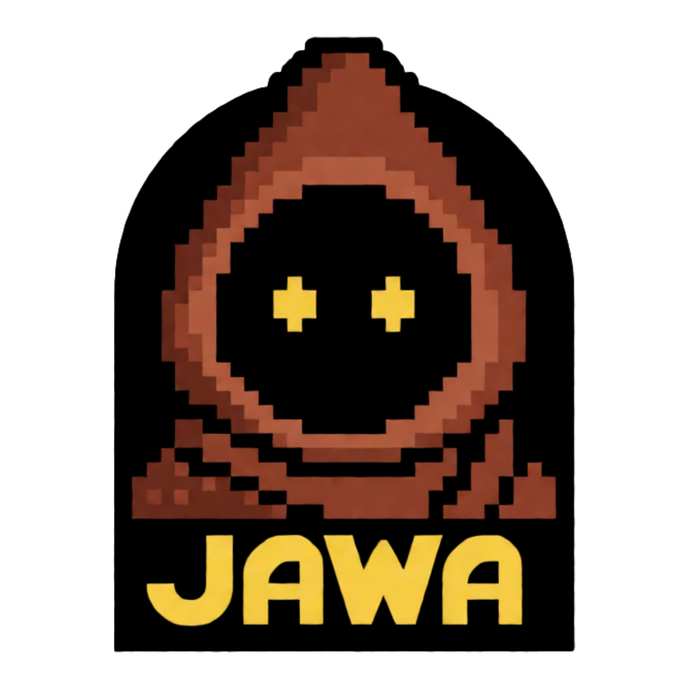

# Jawa



A BONNIE v0.15.0 coding agent that receives asynchronous tasks over NATS.
BONNIE supplies sandboxed coding tools; built-in `ask_human` and
`request_approval` tools are disabled with `WithoutHumanInput`. Missing
requirements are reported in the final response rather than suspending the run.
`instructions.md` defines the coding workflow. No custom tool is required.

## Run locally

Requirements: Go 1.27+, BONNIE v0.15.0, a NATS server, and credentials for your
chosen model provider configured through KIT/BONNIE. The default model is
`opencode/glm-5.3-flash`; set `JAWA_MODEL` to override it.

Start a local JetStream broker (`nats-server -js`), then start the agent:

```sh
export NATS_URL=nats://127.0.0.1:4222
export JAWA_NATS_WORKER_ID=jawa-1
export JAWA_NATS_CREATE_STREAM=true # local provisioning only
bonnie dev
# Or build and run a standalone binary:
bonnie build --output ./bin/jawa
./bin/jawa
```

Outside Docker the HTTP API defaults to loopback at `127.0.0.1:8080`.
`JAWA_HTTP_ADDR` overrides the listener; the Docker image sets `0.0.0.0:8080`. Do not expose it without
an authenticator or an authenticated proxy. NATS must be reachable at startup.

With the NATS CLI, subscribe **before** submitting a task:

```sh
nats --server "$NATS_URL" sub bonnie.results
# In another terminal (with NATS_URL exported):
nats --server "$NATS_URL" pub bonnie.tasks \
  '{"version":1,"task_id":"coding-001","text":"Write a Go function that reverses a string by rune and test it."}'
```

Results include `task_id`, `run_id`, `state`, and `response` or `error`.
Use a new task ID for each request. Built-in human-input tools are disabled,
so normal tasks do not suspend for clarification. Use BONNIE's typed NATS client
for answering waiting runs; answers are worker-routed in JetStream mode.

Each run starts in its own working directory, but Local mode does not enforce
separation from other runs or accessible host/container files. Seed shared
starter files under `workspace/` **before building**, or provide a repository
URL in the task and ask the agent to clone it. Task `context` is an optional
array of strings, not a host-filesystem mount. Generated files remain in the
run workspace; results contain the agent's summary, not automatic commits or
uploaded artifacts. BONNIE journals run state under `.bonnie/` by default.

## Configuration

| Variable | Default / purpose |
| --- | --- |
| `JAWA_MODEL` | `opencode/glm-5.3-flash` |
| `NATS_URL` | `nats://127.0.0.1:4222` |
| `JAWA_NATS_ROOT_SUBJECT` | `bonnie`: derives all protocol subjects and enables JetStream |
| `JAWA_NATS_WORKER_ID` | Required: unique, stable worker token |
| `JAWA_NATS_CONSUMER` | Optional shared durable task consumer |
| `JAWA_NATS_CREATE_STREAM` | Defaults to `true`; set `false` to disable stream creation |

The simplified root setup derives `bonnie.tasks`, `.results`, `.events`,
`.answers`, `.commands`, and `.queries`. Answers/commands/queries append the
worker ID for routing. All routes are now under `bonnie.>`.
**Migration:** the previous root was `bonnie.tasks`; now the default is
`bonnie`. Tasks use `bonnie.tasks`, results `bonnie.results`, events
`bonnie.events`, and control bases `bonnie.answers`, `bonnie.commands`, and
`bonnie.queries`. Derived stream names also change. Provision the new streams
or allow creation; existing pending tasks remain in the old namespace and are
not automatically moved. Coordinate publishers and workers, or temporarily
use `JAWA_NATS_ROOT_SUBJECT=bonnie.tasks` and client `-root bonnie.tasks` to
finish old tasks. Remove old root overrides when migrating.

RootSubject always enables JetStream. Permissions limited to `bonnie.tasks.>`
and `_INBOX.>` are insufficient: grant access to the required `bonnie.*`
protocol routes plus scoped JetStream API, consumer, and acknowledgement
permissions. A stable worker ID and provisioned streams are required.

For broker authentication select **one** method: `NATS_NKEY_SEED` (user seed
value, not file path), `NATS_TOKEN`, or `NATS_USERNAME`/`NATS_PASSWORD`.
Do not combine those methods or URL credentials. Use TLS and broker permissions
in deployments. Secrets are loaded by the channel; Local commands inherit the server
environment and can read these credentials. Do not store them in source or task payloads.

## Sample task client

`cmd/submit` submits one task, logs worker acceptance (`task_accepted`) and run
state events to stderr, then prints the outcome JSON (including the response)
to stdout:

```sh
# Set NATS_URL, NATS_USERNAME, and NATS_PASSWORD through your secret manager.
go run ./cmd/submit -text 'Clone https://github.com/OWNER/REPO, run tests, and report findings.'
# Explicit ID for correlating/retrying the same request:
go run ./cmd/submit -id my-request-001 -timeout 30m -text 'Your instructions'
```

Target a specific worker instead of the shared queue:

```sh
go run ./cmd/submit -worker jawa-1 -text 'Clone mark3labs/kit, run tests and report findings.'
```

The agent and client enable `TargetedTasks`. A targeted task goes to
`bonnie.tasks.worker.<worker-id>` and waits for that worker if it is offline;
it does not fall back to another worker. Without `-worker`, normal shared-queue
submission remains available. Worker IDs must be stable safe tokens.

**Stream migration:** existing input streams must add the literal wildcard
`bonnie.tasks.worker.*` while retaining their current subjects. Update the
stream through your broker administration tooling before deploying; BONNIE
validates existing streams but does not modify them. Newly created streams
include targeted routes automatically. Ensure broker permissions cover them.
Do not delete streams or resubmit pending tasks just to perform this migration.
v0.15.0 also bounds internal cache keys, fixing the v0.14.0 result-storage failure
that caused completed tasks to be redelivered. At-least-once delivery still applies.

Streams must be provisioned. This example uses user/password authentication and
creates independent result/event consumers, so it does not steal results from
another application. It removes its consumers on normal exit; the account needs
consumer create/delete permissions. Forced termination may leave consumers behind
(their names start with `jawa-cli-`). It acknowledges unrelated messages only in
its own readers. A production service should use stable consumers and durable,
idempotent result storage instead.

Acceptance means a worker admitted the task, not that it has completed. Status
and result streams have no cross-stream ordering: a fast result can arrive before
its acceptance log. Duplicate status events are suppressed during this CLI run.
The CLI exits after the first matching outcome, including failures or suspension;
a task can have multiple attempts under at-least-once delivery. Timeout or Ctrl-C
stops waiting, not the worker. Results can contain sensitive information.

## Durable NATS setup

BONNIE derives stable input, result, and event stream names from the root. By
default the agent may create missing streams, so its account needs provisioning
permissions. Set `JAWA_NATS_CREATE_STREAM=false` to bind only provisioned streams.
With a root, creation covers all three streams. Existing streams
must cover the derived protocol subjects with limits retention. Consult BONNIE's
NATS documentation for provisioning and consumer permissions.

Use `github.com/mark3labs/bonnie/client/nats` with `RootSubject: "bonnie"`
for durable submission, result/status consumption, status queries, cancellation,
and routing answers to the original worker. Raw tasks must include `"version":1`.
Persist each worker's own journal and sandbox storage; do not share them between
workers. Delivery is at least once, not exactly once: external effects and result
handlers must be safe to repeat. Lost worker state cannot be reconstructed from
the broker alone.

Jawa explicitly uses `sandbox.Local()`: it provides **no isolation**. The outer
Docker container is the only filesystem/process boundary. Only accept trusted
tasks and repositories; use Docker/microVM per-run sandboxes for untrusted code.
Running the binary outside Docker gives commands access as your host user.

## Docker

The image includes Go 1.27.0, `gh`, Git, build tools, ripgrep, `file`, GNU
`time`, Bash, Python 3 with pip/venv/Pillow, and Lightpanda
(for headless browsing). System-wide Git configuration sets the default commit
identity to `Jawa <jawa@bonnie>`, including inside per-run sandboxes. Repository
configuration can override it. This is commit metadata only, not a GitHub bot
account or custom avatar; PR authorship still comes from `GITHUB_TOKEN`.
It runs Jawa as a non-root user and persists journals
and run workspaces in `/data`. KIT automatically launches `lightpanda mcp` as a
local stdio MCP server and exposes its advertised browser tools to the agent.
No separate browser service, CDP port, or MCP URL is needed. Outside Docker,
install `lightpanda` on PATH before running Jawa. The explicit MCP configuration
in `main.go` replaces MCP servers from KIT config files.

MCP subprocesses are managed by KIT in the agent process environment, not by
BONNIE's per-run shell sandbox. Treat Lightpanda as trusted software with the
container's access, just like Local coding commands.

```sh
docker build -t jawa .
# Export these in your shell or inject them from your secret manager first.
# NATS_URL must be reachable from the container (localhost refers to the container).
docker run --rm --init --name jawa \
  -v jawa-data:/data \
  -e NATS_URL -e NATS_USERNAME -e NATS_PASSWORD \
  -e JAWA_NATS_WORKER_ID -e JAWA_NATS_CREATE_STREAM \
  -e GITHUB_TOKEN -e JAWA_MODEL \
  -e OPENCODE_API_KEY \
  jawa
```

Replace `OPENCODE_API_KEY` with the environment variable required by your model
provider if using another provider. All existing `JAWA_NATS_*` settings can also
be passed with `-e`. Do not bake credentials into the image or supply them as
build arguments. No HTTP port is published in this example: NATS is the remote
interface. To use `bonnie chat` from the host, recreate the container with
`-p 127.0.0.1:8080:8080`. The image listens on all container interfaces, but
publishing on host loopback keeps the unauthenticated API local. Avoid
`-p 8080:8080`, which exposes it on all host interfaces. Containers sharing its
network can still reach the API; use trusted networks or add authentication.

`GITHUB_TOKEN` is explicitly passed into sandboxed coding commands so `gh` can
authenticate without `gh auth login`. **Commands can read this token**: use a
least-privilege, repository-scoped token and only trusted tasks. Local also inherits NATS credentials
and model keys from the server environment. Never print tokens.
For Git operations over HTTPS, run `gh auth setup-git` in the run workspace
before cloning private repositories. Writes, pushes, and PR creation still
require authorization in the task.

Local does not require Landlock syscalls. Do not use privileged mode, mount the
Docker socket, or expose the unauthenticated HTTP API. Preserve the `jawa-data`
volume for run files, but HOME caches and /tmp are container-local and shared
among runs. Run one trusted worker per container to limit cross-task exposure.
Existing Landlock executions may not resume transparently with a different
backend; finish them before switching or submit new tasks, retaining old data.

Lightpanda currently publishes its Linux binaries under `nightly`, so that
default is mutable. For reproducible deployments use an available immutable
release and/or verify the downloaded binary with its SHA-256:

```sh
docker build -t jawa \
  --build-arg LIGHTPANDA_VERSION=nightly \
  --build-arg LIGHTPANDA_SHA256=YOUR_VERIFIED_SHA256 .
```

The image supports amd64 and arm64; hashes are architecture-specific.
`GO_VERSION` is also a build argument (default `1.27.0`).

The container sets `JAWA_SANDBOX_ROOT=/w`, a short symlink to the persistent
`/data/.bonnie/workspaces` directory. Run files remain persistent. Local
commands inherit `TMPDIR=/tmp`, giving tests short writable temporary paths. Outside Docker the
sandbox root defaults to `.bonnie/workspaces`. Deeply nested socket paths can
still exceed Linux's limit; check actual paths before classifying test failures.
Use workspace-local Python virtualenvs for additional dependencies.

## Published Docker images

GitHub Actions builds and pushes a Linux amd64 image to
`ghcr.io/mark3labs/jawa` on every branch or tag push. It can also be triggered
manually from the Actions tab. Tags include the branch name (sanitized), the
Git tag for tag pushes, and `sha-<full-commit-sha>`. Only pushes to `master`
update `latest`.

```sh
docker pull ghcr.io/mark3labs/jawa:latest
```

The workflow uses the built-in `GITHUB_TOKEN` with `packages: write`; no extra
registry credentials are required. Runtime NATS, GitHub, and model credentials
are not supplied to the image build. GHCR packages may initially be private:
set the package visibility to public in GitHub package settings if anonymous
pulls are desired, or authenticate to GHCR for private pulls. The first build
creates the package and attaches repository metadata through image labels.

## Automatic Go diagnostics

`golint.go` uses BONNIE's completion hook to check changed Go packages, not
whole repositories. At execution start it hashes existing Go files. At completion
it compares them and checks new files, excluding clean files in newly cloned
Git repositories. This covers shell edits without turning read-only validation
requests into unsolicited repair work. Existing user changes present at startup
are not considered new edits. The baseline is execution-local: resume/recovery
starts a new baseline. Changes committed inside a newly cloned repository may
not be detected; always run explicit validation before committing/pushing.

Go code orchestrates sandboxed `find`/`sha256sum` and Git commands through
`RunScope.Exec`; no Python helper or direct host filesystem reads are used. Diagnostics
use `go list` to select buildable Go/test files for the current environment,
excluding ignored scripts and alternate-platform files. `gopls` runs per changed
package with a ten-minute module budget, and golangci-lint checks only changed
packages with a two-minute budget. No automatic go fix or source rewriting occurs.
Feedback is capped at 12 KB and permits two repair turns. Unresolved diagnostics
can still fail completion; agents must not repair unrelated code to satisfy them.
Clean test/report tasks receive no completion repair prompt.

The hook requires Bash, find, sha256sum, Git, Go, gopls, and golangci-lint on
PATH. The Docker image includes them; Python remains available for coding tasks
but is not required by the hook.

## Activity and workspace retention

Live activity is logged to stdout with BONNIE's Info-level activity logger,
including run states, tool names, failures, and final responses. Replayed events
are not logged again. Final response text can contain sensitive data; restrict
access to container logs. Debug payload logging is not enabled.

Automatic workspace cleanup runs at startup and every minute (BONNIE's cadence):
completed workspaces are retained 7 days, failed ones 14 days, and cancelled or
retired ones 3 days from their latest terminal checkpoint. Active, pending, and
waiting runs are preserved. Journals and channel addresses remain; after cleanup,
a later turn on a completed conversation starts with an empty workspace. Export
artifacts or push authorized changes before retention expires. Each instance
must own its own journal/workspace volume; do not share a volume between workers.

## Development

```sh
go test ./...
go vet ./...
bonnie build --output ./bin/jawa
```

Edit `main.go` for runtime options and `instructions.md` for behavior. BONNIE
regenerates `bonnie_gen.go`; do not edit it manually.
